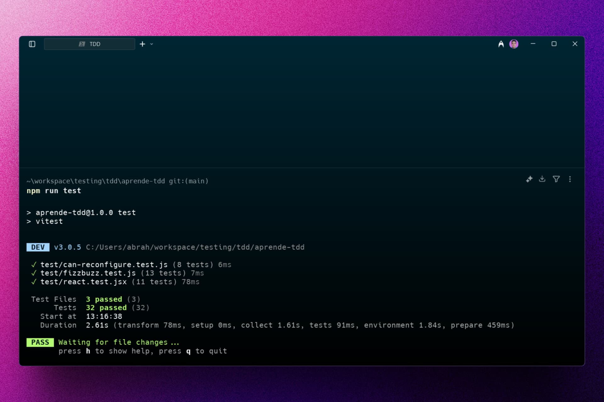

<div align='center'>

# 🎭 Vitest + React Testing Library: Aprende TDD

</div>

### Códigos para aprender TDD.




## 🚀 Descripción

Este repositorio contiene ejercicios y ejemplos para aprender TDD (Test-Driven Development) en JavaScript usando Vitest y React Testing Library.

Incluye pruebas unitarias e integración para utilidades (por ejemplo, fizzbuzz y can-reconfigure) y componentes de React (como un sencillo Calculator), además de reporte de cobertura generado con Vitest. La aplicación se sirve con Vite para un flujo de desarrollo rápido.

## ⚡ Comenzar

### Prerrequisitos

1. Git.
2. Node.js 20 o superior.

## 🔧 Instalación

### Usando npm

1. **Clona el repositorio:**

   ```bash
   git clone https://github.com/abrahamgalue/aprende-tdd.git
   cd aprende-tdd
   ```

2. **Instala las dependencias:**

   ```bash
   npm install
   ```

### Ejecución de tests

Puedes ejecutar los tests con Vitest y revisar la cobertura.

1. **Ejecuta los tests:**

   ```bash
   npm run test
   ```

   Revisa el archivo `package.json` para ver los diferentes scripts disponibles.

2. **Cobertura:**

   ```bash
   npm run coverage
   ```

   Se generará un informe HTML en la carpeta `coverage/`.

## 🎭 Tecnologías

- [**Vitest**](https://vitest.dev/) Para realizar pruebas unitarias y de integración.
- [**React Testing Library**](https://testing-library.com/docs/react-testing-library/intro/) Para testear componentes de React.
- [**Vite**](https://vitejs.dev/) Para el entorno de desarrollo y build.
- [**Happy DOM**](https://www.npmjs.com/package/happy-dom) Como entorno DOM para tests.
- [**StandardJS**](https://standardjs.com/) Para el linting del código.
- [**React**](https://react.dev/) Para la UI y componentes.
